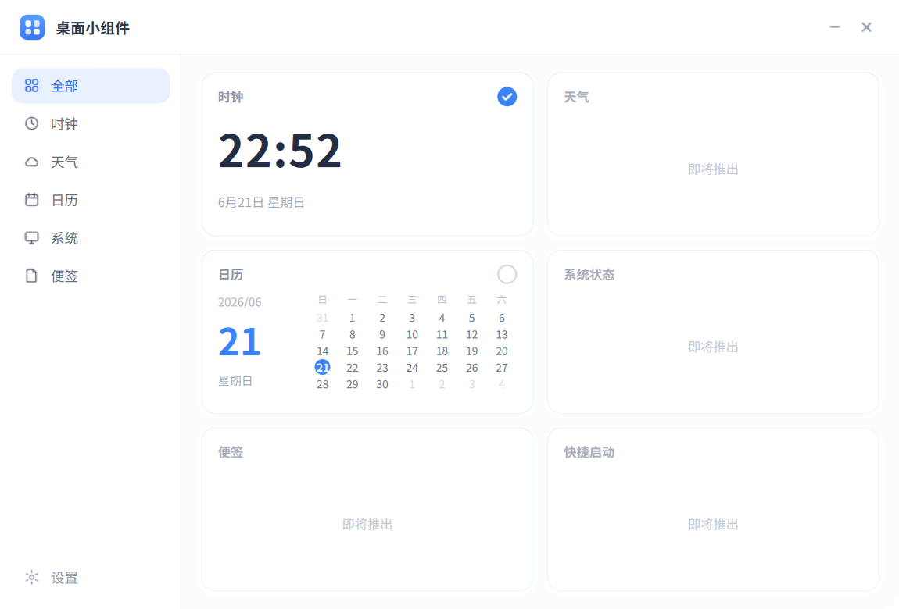
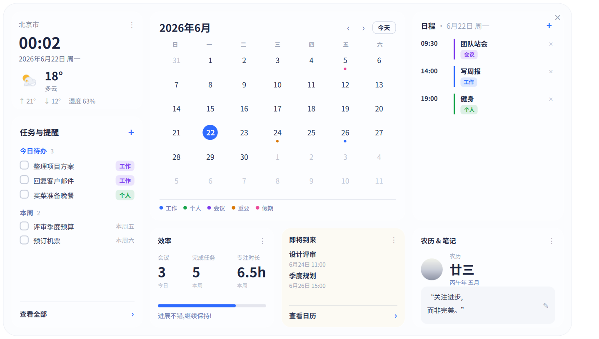

# Vitrine · 桌面小组件管理器

> 玻璃质感、macOS 风格的 Linux 桌面小组件管理器，基于 **PySide6 + Qt Quick / QML** 构建。

<p>
  <a href="https://github.com/CoderYuanX/Vitrine/releases/latest"></a>
  
  
  
  
</p>

<p align="center">
  
</p>

<p align="center">
  
  <br>
  <sub>日历组件 · 展开仪表盘:本地可编辑事件、月份翻页、当日日程</sub>
</p>

---

## ✨ 特性

- **实时缩略预览卡片** —— 每张卡片的卡身就是该组件的真实预览（时钟走秒、日历高亮今日），不是静态图标。
- **一键启停桌面挂件** —— 卡片右上角的圆形开关直接控制该组件在桌面上的显示 / 隐藏。
- **系统托盘常驻** —— 关闭窗口收起到托盘，右键菜单可逐个勾选组件或打开管理面板；托盘与面板状态**双向同步**。
- **无边框玻璃卡片界面** —— 920×624 圆角主窗，按窗口尺寸等比缩放（锁定纵横比，无拉伸、无透明留白）。
- **单实例运行** —— 重复启动自动聚焦已有实例，不开多个。
- **开机自启** —— 设置面板内可开关（写入 XDG autostart）。
- **配置持久化** —— 组件启用状态与桌面布局落盘，重启自动恢复。
- **实时天气** —— 卡片显示实时天气(Open‑Meteo),默认按 IP 自动定位;可在设置里**关闭自动定位或手填城市**,关闭后不再上报 IP 位置。

## 🧩 组件清单

| 组件 | 标识 | 状态 |
| --- | --- | --- |
| 🕐 时钟 | `clock` | ✅ 已实现 |
| 📅 日历 | `calendar` | ✅ 已实现 |
| ☁️ 天气 | `weather` | 🚧 即将推出 |
| 🖥️ 系统状态 | `system` | 🚧 即将推出 |
| 📝 便签 | `note` | 🚧 即将推出 |
| 🚀 快捷启动 | `launcher` | 🚧 即将推出 |

> 新增组件 = 在 `widgets/` 下新建一个目录 + 一份 `widget.json`，管理器会自动发现并按 `GALLERY_ORDER` 排序展示。

## 🚀 安装与运行

需要 Python 3.10+（开发于 3.12）与 Linux 桌面（主要目标平台为 Deepin 25 / X11）。

```bash
# 1. 克隆
git clone https://github.com/CoderYuanX/Vitrine.git
cd Vitrine

# 2. 安装依赖（建议使用虚拟环境）
python -m venv .venv && source .venv/bin/activate
pip install -r requirements.txt

# 3. 运行
python main.py
```

依赖：`PySide6>=6.6`、`psutil`、`requests`、`python-xlib`（Linux）。

### 打包为 .deb（Deepin / Debian 系）

提供打包脚本，应用装到 `/opt/vitrine`。Deepin 源无 PySide6，故依赖随包走，两种模式:

```bash
# 瘦包(~26KB,推荐):安装时联网 pip 拉依赖
packaging/build-deb.sh --thin
sudo apt install ./dist/vitrine_0.1.0-thin_amd64.deb

# 自包含(~52MB):deb 内置 venv,离线即装即用
packaging/build-deb.sh
sudo apt install ./dist/vitrine_0.1.0_amd64.deb
```

装好后启动器搜索「Vitrine 桌面小组件」或终端运行 `vitrine`。详见 [packaging/README.md](packaging/README.md)。

## 🖱️ 使用

应用启动后**常驻系统托盘**，主窗口不会自动弹出：

1. 在系统托盘找到「桌面小组件」图标（主题图标 `preferences-desktop-display`，缺失时为珊瑚红圆角方块）。
2. **右键** → **「打开管理面板」**。
3. 在面板里点卡片右上角的开关，即可把对应组件挂到桌面 / 从桌面移除。

> 托盘右键菜单同样可以逐个勾选组件、退出应用，状态与管理面板实时同步。

## 🏗️ 架构

```
main.py                    单实例守卫 → 启动 ManagerApp
└── src/manager/
    ├── app.py             组装 registry / config / runtime / catalog / tray，加载 Manager.qml
    ├── registry.py        扫描 widgets/ 目录发现组件（widget.json），按 GALLERY_ORDER 排序
    ├── runtime.py         桌面挂件的创建 / 显隐 / 生命周期
    ├── catalog_bridge.py  QML ↔ Python 桥（分类、可见列表、toggle / showAll / hideAll）
    ├── layout_bridge.py   桌面布局（位置 / 尺寸）读写
    ├── config_store.py    配置持久化（启用状态 + 布局）
    ├── tray.py            系统托盘图标与菜单，与面板双向同步
    ├── autostart.py       XDG 开机自启
    ├── single_instance.py 单实例锁
    └── x11.py             X11 桌面集成辅助
```

界面层（QML）位于 `ui/`，桌面组件位于 `widgets/<名称>/`（各含 `widget.json` + QML）。
界面像素级对齐 `docs/design-specs/2026-06-21-widget-manager-ui.md` 设计规格。

## 📁 项目结构

```
.
├── main.py                 入口
├── requirements.txt
├── src/manager/            后端运行时与桥接
├── ui/                     管理面板 QML（Manager / Sidebar / GalleryCard / TitleBar / SettingsPanel ...）
├── widgets/                可发现的桌面组件（时钟 / 日历 / 天气 / 系统 / 便签 / 快捷启动）
├── tools/                  预览 / 离屏截图 / 托盘自检等开发工具
├── tests/                  pytest 单元测试
└── docs/design-specs/      UI 设计规格（唯一事实来源）与截图
```

## 🛠️ 开发

```bash
# 运行测试
python -m pytest -q

# 离屏渲染管理面板为 PNG（README 截图即由此生成）
python tools/shoot.py ui/Manager.qml docs/screenshots/manager.png

# 不挂托盘、直接预览管理面板（mock 数据）
python tools/preview_manager.py
```

## 🆕 更新点

### v0.1.0(首个发布)

**新功能**
- **日历组件**:折叠紧凑卡 ↔ 展开仪表盘;**本地可编辑事件**(点某日增删,持久化到 `events.json`)、**月份翻页**(`‹ › / 今天`)、当日日程随选中日联动、月历彩色事件圆点、即将到来。
- **实时天气**:Open‑Meteo 取数 + IP 自动定位,卡片显示真实天气;**可手填城市或关闭自动定位**(关闭后不再上报 IP;城市支持拼音/英文,如 `chongqing → 重庆`)。
- **全界面中文化**;无边框玻璃卡片 UI 按窗口等比缩放(锁定纵横比,无拉伸/透明留白)。
- **打包**:`packaging/build-deb.sh` 产出 deb(thin 瘦包 ~26KB / bundled 自包含 ~52MB),并提供 [GitHub Release](https://github.com/CoderYuanX/Vitrine/releases) 下载。

**修复**
- 日历展开态禁用滚轮缩放(展开 = 固定仪表盘)。
- 选中日的日程标题随所选日期变化(不再恒为今天)。
- 翻月把选中日收敛到合法范围(避免 `2026-02-31` 之类不存在的日期)。
- 事件存储校验日期、规范化时间(24h),坏数据不落盘。
- 城市输入框不再被设置开关清空。
- 展开仪表盘入场动画消除透明窗口半透明残影。
- 消除启动时的 `dxcb` 平台插件告警。

**已知限制**
- 中文输入法(fcitx5)在 pip 版 PySide6(Qt 6.11)下无法加载系统 fcitx 插件(系统插件为 Qt 6.8,私有 ABI 不兼容)。城市框请用拼音/英文输入,会自动解析为中文城市。

## 🗺️ 路线图

- [ ] 实现「天气 / 系统状态 / 便签 / 快捷启动」组件
- [ ] 管理面板内拖拽调整桌面组件位置
- [ ] 主题 / 浅深色切换
- [ ] Wayland 支持（当前主打 X11）

## 📄 许可证

[MIT](LICENSE) © CoderYuanX
