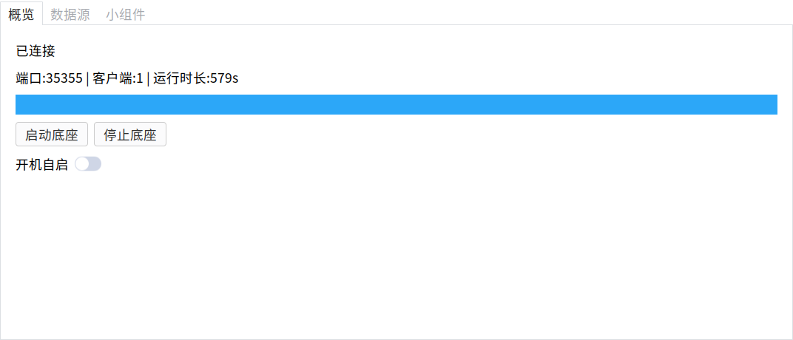
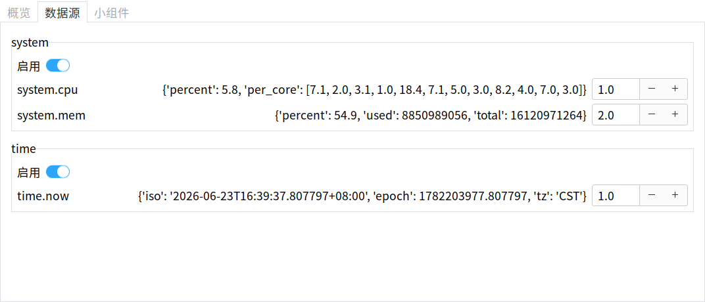

<div align="center">

# deskwidgets

**Desktop widgets for Linux** — 一个常驻系统托盘的桌面小组件管理器。
数据底座(`core`)实时采集系统/时间等指标,管理面板(`manager`)订阅展示并管控。

<p>
  
  
  
  
  
</p>

</div>

---

## ✨ 这是什么

`deskwidgets` 把桌面小组件拆成 **两个解耦进程**:

| 进程 | 角色 | 入口 |
| --- | --- | --- |
| **`core`**(数据底座) | 后台采集数据(CPU / 内存 / 时间…),通过本地 WebSocket 广播,支持鉴权 token、自发现端口 | `python -m core` |
| **`manager`**(管理面板) | GTK3 面板,订阅底座数据、管控数据源、常驻系统托盘 | `python -m manager` |

面板像 QQ / 微信一样**常驻托盘**:关窗 / 最小化收进托盘、登录自启、托盘随连接状态变色,退出只退面板、底座照常运行。

<div align="center">

| 概览 · 连接状态与启停 | 数据源 · 实时跳动 |
| :---: | :---: |
|  |  |

</div>

## 🚀 快速开始

```bash
# 1) 系统依赖(PyGObject 无法用 pip 装,需系统包)
#    Debian / Deepin 系:
sudo apt install python3-gi gir1.2-gtk-3.0 gir1.2-webkit2-4.1 gir1.2-ayatanaappindicator3-0.1

# 2) 建 venv,装 Python 依赖 + 包本体
python3 -m venv --system-site-packages .venv
.venv/bin/pip install psutil websockets tomli-w pytest
.venv/bin/pip install -e .          # 安装包本体,使 -m manager / -m core 在任意 cwd 可用

# 3) 运行(只起面板即可,~2s 宽限期后会自动拉起底座)
.venv/bin/python -m manager
```

> **为何需要 `pip install -e .`** —— 开机自启的 `.desktop` 用 `Exec=<venv>/python -m manager`,
> 登录拉起时工作目录通常不是仓库根目录。不安装包本体的话 `python -m manager` 会报
> `ModuleNotFoundError: No module named 'manager'`(只在仓库根目录才找得到)。装为可编辑包后任意
> 工作目录都能解析,自启才可靠。

也可分别启动:

```bash
.venv/bin/python -m core       # 仅底座
.venv/bin/python -m manager    # 仅面板
```

## 🖼️ 系统托盘与常驻

面板是常驻系统托盘应用(Deepin dock):

- **关窗 / 最小化** —— 首次点窗口 × 会询问「最小化到托盘 / 退出」,可勾「记住我的选择」;
  点最小化按钮也会收进托盘,不在 dock 残留运行条目。
  偏好存 `~/.config/managewidgets/manager.toml`,与 `core` 的 `config.toml` 分开(避免两进程抢写)。
- **托盘菜单** —— 显示/隐藏面板、启动/停止底座、开机自启、退出。
  图标随连接状态变 🟢 绿 / ⚪ 灰。**退出只退面板,`core` 底座继续运行**(要停底座用菜单「停止底座」)。
- **开机自启** —— 打开后登录即在托盘,并自动拉起底座、数据开始跳。自启的 `.desktop`
  **历史原因沿用文件名 `managewidgets-core.desktop`,实际自启的是 `manager` 面板**(`Exec=… -m manager`)。
- **缺托盘库时优雅降级** —— 若未装 `gir1.2-ayatanaappindicator3-0.1`,面板仍可运行,
  只是没有托盘图标(降级为普通窗口,关窗即退出)。

## 🧪 测试

```bash
.venv/bin/python -m pytest -q          # 全量(73 passing)
.venv/bin/python -m pytest -v          # 详细
```

> 无图形显示(CI)环境下,GUI / 托盘相关用例会自动 `skip`;纯逻辑用例照常运行。

## 🗂️ 项目结构

```
core/                数据底座:provider 采集、WebSocket hub、状态/配置、自启
manager/             管理面板:GTK3 多页 UI、WS 客户端、托盘封装、本地偏好
  ├─ app.py          ManagerApp:生命周期 / 关窗到托盘 / 启动拉核 / 状态同步 / 单实例
  ├─ tray.py         TrayIndicator(AyatanaAppIndicator3)
  ├─ settings.py     面板本地偏好(close_to_tray)+ decide_close + 自启 exec 串
  └─ pages/          概览 / 数据源 / 小组件(占位)
tests/               pytest:纯逻辑 + GUI 冒烟(无显示自动 skip)
docs/                spec / plan / 截图
```

## 📋 已知问题与修复记录

下列问题在代码评审与真机 GUI 验证阶段发现,均已修复并合并到 `main`:

- **最小化仍占 dock 运行条目(已修复)**:原先只有关窗(×)走 close-to-tray,点最小化按钮窗口
  iconify 后仍在 dock / 任务栏留一个运行条目。现接管 `window-state-event`,有托盘时把 iconify
  转为 `hide()`(从 dock 移除条目),无托盘则保持系统默认最小化以免窗口无处唤回。
- **开机自启在仅装依赖时失败(已修复)**:自启 `Exec` 用 `python -m manager`,但仅装依赖未安装包本体,
  登录态 cwd 非仓库根 → `ModuleNotFoundError`。安装步骤补 `pip install -e .`(`pyproject` 已配
  `packages.find` + console scripts,可编辑安装后任意 cwd 可解析)。
- **底座入口绑定失败被吞掉(已修复)**:`start_in_thread()` 在 `serve()` 绑定失败时只在后台线程
  re-raise,调用方空等 5s 后拿到 `port=None`。现把异常带回主线程——就绪即返回,失败抛 `OSError`,
  未就绪抛 `TimeoutError`。
- **数据源页整页空白(已修复)**:动态新增的 provider 组 `frame` 未 `show_all()`,而窗口 `show_all()`
  早于数据到达,后加的子树默认不可见。现 `_ensure_group` 加入容器后调用 `frame.show_all()`。
- **数据源页开关/间隔不随 status 同步(已修复)**:每帧 status 经 `_sync_switch`/`_sync_interval` 回写,
  并 `handler_block` 屏蔽信号以免回环触发 `set_provider`/`set_interval`。

当前仍存在、但无害:

- 运行 GTK 时控制台可能打印 `g_value_set_boxed` 断言与 `AT-SPI` 总线告警——均来自系统 PyGObject /
  无障碍库,与本程序无关,不影响功能,测试也照常全过。
